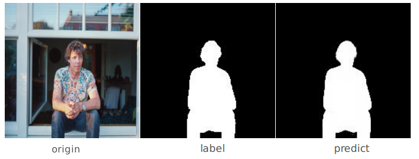

# NLFD
[中文说明](./README.zh.md)

An unofficial implementation of [Non-Local Deep Features for Salient Object Detection](https://sites.google.com/view/zhimingluo/nldf).

<p align="center"></p>

The official Tensorflow version: [NLFD](https://github.com/zhimingluo/NLDF)

Some thing difference:

1. dataset
2. score with one channel, rather than two channels
3. two version of IOU: area-IOU and boundary-IOU (area-IOU is better) (will add a combine version)

## Prerequisites

- [Python 3](https://www.continuum.io/downloads)
- [Pytorch 0.3.0](http://pytorch.org/)
- [torchvision](http://pytorch.org/)
- [visdom](https://github.com/facebookresearch/visdom) (optional for visualization)

## Usage

### 1. Clone the repository

```shell
git clone git@github.com:AceCoooool/NLFD-Pytorch.git
cd NLFD-Pytorch/
```

### 2. Download the dataset

Note: the original paper use other datasets.

Download the [ECSSD](http://www.cse.cuhk.edu.hk/leojia/projects/hsaliency/dataset.html) dataset.  

```shell
bash download.sh
```

### 3. Get pre-trained vgg

```bash
cd tools/
python extract_vgg.py
cd ..
```

### 4. Demo

```shell
python demo.py --demo_img='your_picture' --trained_model='pre_trained pth' --cuda=True
```

Note: 

1. default choose: download and copy the [pretrained model](https://drive.google.com/file/d/10cnWpqABT6MRdTO0p17hcHornMs6ggQL/view?usp=sharing) to `weights` directory.
2. a demo picture is in `png/demo.jpg`

### 5. Train

```shell
python main.py --mode='train' --train_path='you_data' --label_path='you_label' --batch_size=8 --visdom=True --space=True
```

Note:

1. `--space=True` choose the Space-IOU. `false` choose the Boundary-IOU
2. `--val=True` add the validation (but your need to add the `--val_path` and `--val_label`)
3. `you_data, you_label` means your training data root. (connect to the step 2)

### 6. Test

```shell
python main.py --mode='test', --test_path='you_data' --test_label='your_label' --batch_size=1 --model='your_trained_model'
```

Note: It's a scale version (image and label is resized) of test.

## Bug

1. Error of `inf` when the learning rate is large.
2. The Boundary-IOU is not precision.

Maybe, it is better to add Batch Normalization. 