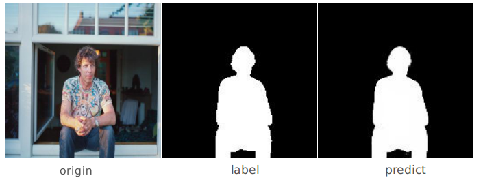
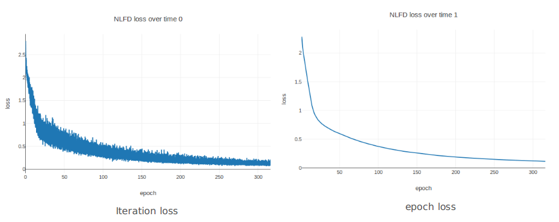

# NLFD
[English](./README.md)

基于Pytorch的非官方版本实现： [Non-Local Deep Features for Salient Object Detection](https://sites.google.com/view/zhimingluo/nldf).

<p align="center"></p>

官方Tensorflow版本链接: [NLDF](https://github.com/zhimingluo/NLDF)

此实现的几点改动:

1. ~~数据集（个人没找到MSRA-B的图片）~~
2. 网络结构上的一些不同：此处采用最后输出为单个概率图，官方版本中是两个互异的概率图
3. 增加了“面积重合率”，原论文中是“边缘重合率” （可同时选择两者）

## 依赖库

- [Python 3](https://www.continuum.io/downloads)
- [Pytorch 0.3.0](http://pytorch.org/)
- [torchvision](http://pytorch.org/)
- [visdom](https://github.com/facebookresearch/visdom) (optional for visualization)

## 复现情况

迭代过程中的损失函数下降情况：



性能：

| Dataset | max F(paper) | MAE(paper) | max F(here) | MAE(here) |
| :-----: | :----------: | :--------: | :---------: | :-------: |
|  ECSSD  |    0.905     |   0.063    |   0.9830    |  0.0375   |

说明：

1. 此处复现采用的是面积IOU，原始论文采用的是边缘IOU
2. 此处的比较是“不公平”，两者采用的数据集并不相同，且直接拿了训练集来测的指标（只是为了说明性能能够达到甚至超过原始paper）--- 原始论文中的数据集个人没找到。

## 使用说明

### 1. 复制仓库到本地

```shell
git clone git@github.com:AceCoooool/NLFD-pytorch.git
cd NLFD-pytorch/
```

### 2. 从网上下载数据集

注：原始论文中采用更多的数据集

可从下面链接下载数据集： [ECSSD](http://www.cse.cuhk.edu.hk/leojia/projects/hsaliency/dataset.html)  

```shell
bash download.sh
```

### 3. 提取预先训练好的VGG

```bash
cd tools/
python extract_vgg.py
cd ..
```

注：此处个人直接采用torchvision里面训练好的VGG

### 4. 示例

```shell
python demo.py --demo_img='your_picture' --trained_model='pre_trained pth' --cuda=True
```

注：

1. 默认参数：下载[训练好的模型](https://drive.google.com/file/d/10cnWpqABT6MRdTO0p17hcHornMs6ggQL/view?usp=sharing)并复制到`weights`文件夹下
2. 示例图片：默认采用`png/demo.jpg`

### 5. 训练

```shell
python main.py --mode='train' --train_path='you_data' --label_path='you_label' --batch_size=8 --visdom=True --area=True --boundary=False
```

注：

1. `--val=True`：训练阶段开启validation. 你可以将部分训练集作为验证集。同时提供验证集的路径
2. `you_data, you_label` ：关于第2步中数据集的路径
3. `--area --boundary`：选择area-IOU或者boundary-IOU，或者两者均选择（体现在损失函数里面`loss.py`，建议采用默认的形式---只选择 area=True）

### 6. 测试

```shell
python main.py --mode='test', --test_path='you_data' --test_label='your_label' --batch_size=1 --model='your_trained_model'
```

注：

1. 采用的指标和原始论文一致（改写自原代码）

## Bug

1. 采用boundary-iou容易出现`inf`的情况：需要将学习率调整到很小，如`1e-10`
2. 可能还存在数值问题


如有任何问题，欢迎在issue中提问～